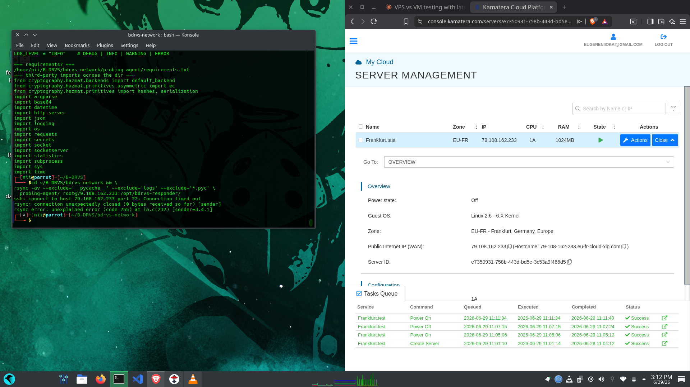
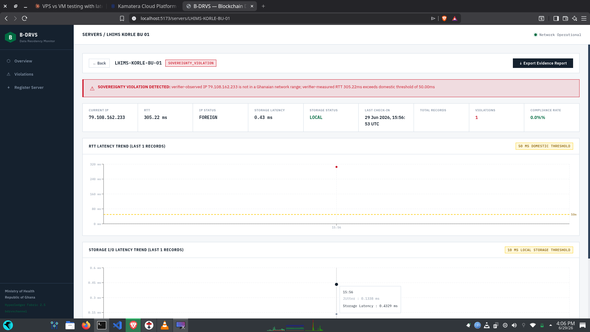
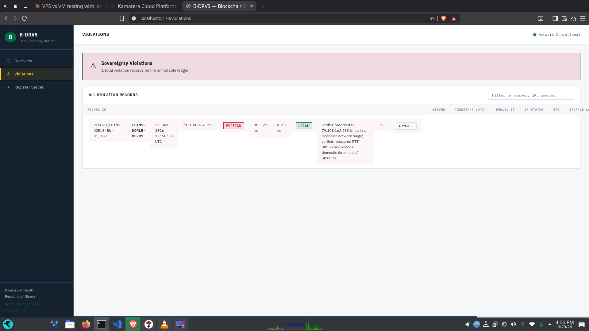
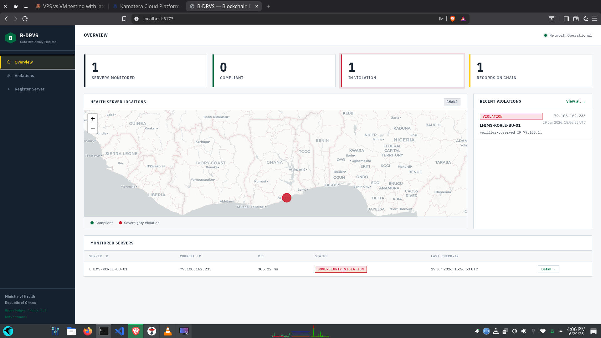
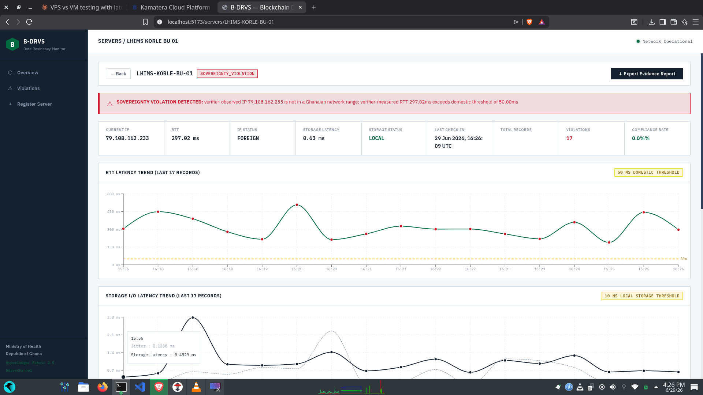
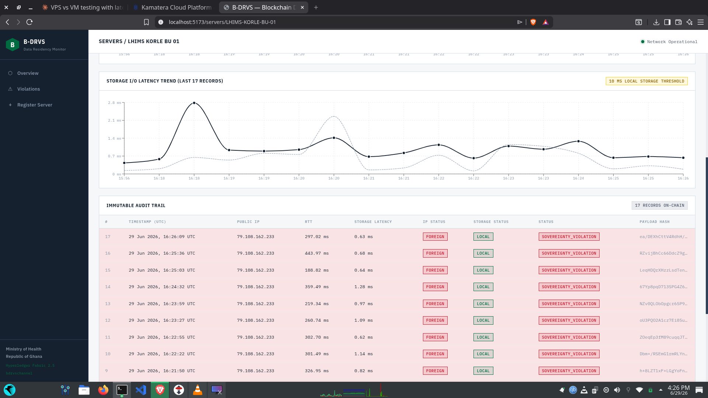
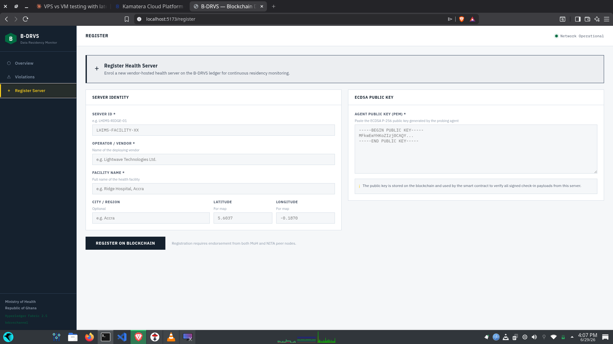

# B-DRVS — Blockchain-Based Data Residency Verification System

**Continuous, tamper-evident, independently verifiable proof of where a health server actually sits — built for Ghana.**


---

## Why This Exists

In 2025, Ghana's Ministry of Health and a private health-IT vendor, Lightwave, got into a public dispute over a simple question:

> **"Is Ghanaian patient data hosted in Accra, or in India?"**

The Ministry said one thing. The vendor said another. And here's the embarrassing part — **neither side could prove anything.** There was no independent system anywhere in the country that could verify where the servers holding millions of Ghanaians' medical records were physically located.

Ghana has laws that require health data to stay under Ghanaian jurisdiction — the **Data Protection Act, 2012 (Act 843)** and the **Cybersecurity Act, 2020 (Act 1038)**. But a law is only as strong as its enforcement, and enforcement today looks like this: an auditor visits a data centre once in a while, looks around, writes a report, and leaves. Between visits, data can be moved or replicated abroad and **nobody would know.**

That gap — between what the law demands and what the state can actually verify — is the problem B-DRVS attacks.

---

## The Idea in One Paragraph

Instead of trusting the vendor's word or a once-a-year audit, B-DRVS **continuously measures** where a registered health server appears to be on the network, using **three independent physical signals**, and writes every measurement onto a **permissioned blockchain** that no single party — not the vendor, not even the Ministry — can edit or delete afterwards. If the server drifts outside Ghana, the ledger says so, permanently, with cryptographic evidence attached.

---

## How It Works 

Think of it like a tamper-proof GPS tracker for servers — except servers don't have GPS, so we use physics and network records instead:

1. **IP address check** — Every server on the internet has a public IP address. Blocks of IP addresses are officially registered to countries by AFRINIC (Africa's internet registry). B-DRVS checks the server's IP against a whitelist of genuine Ghanaian ranges. Foreign IP → red flag.

2. **Round-Trip Time (RTT)** — Light in fibre-optic cable has a hard speed limit. A message sent from Accra to a server *in Accra* comes back in well under **50 milliseconds**. A message to Frankfurt or Mumbai physically *cannot* come back that fast. If the "Accra" server takes 300ms to answer, it is not in Accra. You can lie about your address; you cannot lie about the speed of light.

3. **Storage I/O latency** — Measures how fast the server can touch its own disk, helping detect setups where the machine answering is local but its actual storage is mounted from somewhere far away.

Each check produces a cryptographically **signed** record (ECDSA P-256 — the same family of cryptography that secures online banking), so a vendor can't forge a check-in pretending to be the real server. The record then goes onto the blockchain, where **two independent government organisations (Ministry of Health + NITA) must both endorse it** before it's committed. Once committed, it can never be altered.

### The Key Design Decision: Don't Trust the Vendor's Measurements

Early residency-verification ideas let the monitored server report its *own* IP and latency. That's like asking a suspect to fill in their own alibi. B-DRVS instead uses a **verified challenge–response path**:

- An **independent verifier node** (operated by NITA, the government's IT agency) sends a random, single-use challenge (a *nonce*) to the server.
- The verifier — **not the vendor** — measures how long the signed response takes and observes which IP it came from.
- The verifier signs its own measurements and submits them to the chain.

The vendor never gets to grade its own homework. This is the project's core architectural contribution.

---

## Architecture

Three tiers, end to end:

```
┌─────────────────────┐     signed challenge/response      ┌──────────────────────────┐
│  TIER 1             │ ◄────────────────────────────────► │  NITA VERIFIER NODE      │
│  Vendor Health      │                                    │  issues nonces, measures │
│  Server + Responder │                                    │  RTT & observes IP       │
│  (Python)           │                                    │  (Python)                │
└─────────────────────┘                                    └────────────┬─────────────┘
                                                                        │ signed verdict
                                                                        ▼
                                              ┌─────────────────────────────────────────┐
                                              │  TIER 2 — Hyperledger Fabric 2.5        │
                                              │  Two orgs: MoH + NITA (both must        │
                                              │  endorse every transaction)             │
                                              │  Go chaincode validates:                │
                                              │   • signature vs registered public key  │
                                              │   • IP vs AFRINIC Ghana whitelist       │
                                              │   • RTT vs 50 ms domestic threshold     │
                                              │   • storage latency                     │
                                              │  → COMPLIANT / SOVEREIGNTY_VIOLATION    │
                                              │    written to the immutable ledger      │
                                              └────────────────────┬────────────────────┘
                                                                   │ query / events
                                                                   ▼
                                              ┌─────────────────────────────────────────┐
                                              │  TIER 3 — Dashboard                     │
                                              │  Node/Express gateway + React/Vite UI   │
                                              │  Compliance map, RTT trends, audit      │
                                              │  trail, evidence export for regulators  │
                                              └─────────────────────────────────────────┘
```

**Stack:** Python 3.11 (agent, verifier, responder) · Hyperledger Fabric 2.5.9 (two-org network) · Go chaincode · Node.js/Express gateway · React + Vite dashboard · ECDSA P-256 signatures · Docker Compose · AFRINIC RDAP/WHOIS for Ghana IP sourcing.

---

## The System in Action (Live Test Results)

We didn't just simulate this. We ran a **real multi-jurisdiction test**: the verifier ran in **Kumasi, Ghana**, and the "vendor server" was a real VPS in **Frankfurt, Germany** — deliberately violating residency to see whether the system would catch it.

It did. Every single time.

### 1. Deploying the foreign server

A Kamatera cloud VPS in Frankfurt (`79.108.162.233`) running the responder as a persistent systemd service — playing the role of a vendor secretly hosting Ghanaian health data abroad.



### 2. The dashboard overview

One monitored server, zero compliant, one in violation. The red marker sits where the *registered* facility is — and the system is flagging that the machine answering for it is not in Ghana.



### 3. A violation is caught

First verified check-in: the verifier observed IP `79.108.162.233` (not a Ghanaian range) and measured **305.22 ms** RTT — six times over the 50 ms domestic threshold. Verdict: `SOVEREIGNTY_VIOLATION`, recorded on-chain.





### 4. Continuous monitoring, not a snapshot

This is the whole point versus manual audits. Over the test window the system logged **17 consecutive verified check-ins**, every one a violation, with RTTs ranging from ~188 ms to ~507 ms — all physically impossible for a server inside Ghana.



### 5. The immutable audit trail

Every record carries a timestamp, the verifier-observed IP, verifier-measured RTT, storage latency, verdict, and a payload hash — endorsed by both MoH and NITA peers before commitment. This is the evidence package that did not exist during the 2025 dispute.



### 6. Registering a server

Regulators enrol a vendor server by registering its identity, facility details, and the ECDSA public key of its probing agent. From that point on, only payloads signed by that key are accepted for that server.



---

## What's Been Built and Verified So Far

- ✅ **Full three-tier pipeline working end-to-end** — probing/responder → chaincode/ledger → live React dashboard.
- ✅ **Verified challenge-response path** — verifier-issued nonces, verifier-measured RTT, verifier-observed IP; vendor-supplied values are never trusted.
- ✅ **Live international test complete** — 17 verified check-ins from a real Frankfurt VPS, all correctly flagged as `SOVEREIGNTY_VIOLATION` with provenance on the ledger.
- ✅ **Adversarial test suite passing** — tampering, signature forgery, replay attacks, stale nonces, cross-verifier confusion, and unregistered-key submissions are all rejected. The compliant path is validated by unit test (`TestVerifiedFreshCompliantAccepted`), since no machine outside Ghana's routable IP space can honestly produce a `COMPLIANT` verdict — which is itself evidence the system works as intended.
- ✅ **Chaincode hardened** — private (RFC1918) ranges removed from the Ghana whitelist; non-routable-IP guard added to check-in validation.
- ✅ **Gateway hardened** — chaincode rejections now surface as clean `400` errors, distinguished from `500` infrastructure failures.
- ✅ **Deterministic chaincode** — uses transaction timestamps (`GetTxTimestamp`) rather than wall-clock time, avoiding Fabric endorsement non-determinism.

## Known Limitations (Stated Honestly)

- **B-DRVS verifies the location of a registered network endpoint, not the data itself.** A determined vendor could run the responder on a compliant box in Accra while the real database sits abroad (a "proxy-in-Accra" attack). Closing this fully requires **hardware attestation** (TPM/SGX binding the responder to specific physical hardware) — named as the production-grade next step, out of scope for this prototype.
- A single verifier gives a distance *radius*, not a precise position. Multi-verifier triangulation (Accra + Kumasi + Tamale) is the planned extension.
- RTT is far stronger at proving a server is **far away** than proving it's nearby — hence the multi-signal, defence-in-depth design.
- IP geolocation can be degraded by VPNs/proxies in isolation, which is precisely why no single signal is trusted alone.

## Roadmap

- [ ] Extend the non-routable-IP guard to the verified check-in path (`SubmitVerifiedCheckIn`)
- [ ] Multi-verifier triangulation (additional nodes in Kumasi and Tamale)
- [ ] Data Protection Commission as a third endorsing organisation
- [ ] Hardware attestation (TPM) for endpoint-to-hardware binding
- [ ] Traffic-path (traceroute) analysis as an additional signal
- [ ] Thesis Chapters 4 & 5 incorporating the live-test evidence

---

## Repository Layout

```
B-DRVS/
├── bdrvs-network/          # Hyperledger Fabric network config & deployment
│   └── probing-agent/      # Python agent, verifier, and responder
├── chaincode/              # Go smart contracts (residency.go, verified.go + tests)
├── gateway/                # Node/Express REST gateway to Fabric (fabric.js, routes.js)
├── dashboard/              # React + Vite regulator dashboard
├── evidence/               # Captured live-test evidence (JSON records, ping logs)
└── docs/                   # Documentation, TODOs, screenshots
```

*(Adjust paths above if your local layout differs.)*

## Quick Start (High Level)

Full setup requires Docker, Docker Compose, Go, Node.js, and Python 3.11.

```bash
# 1. Bring up the two-org Fabric network (MoH + NITA) and deploy chaincode
cd bdrvs-network && ./startFabric.sh

# 2. Start the REST gateway
cd gateway && npm install && npm start

# 3. Start the dashboard
cd dashboard && npm install && npm run dev   # → http://localhost:5173

# 4. Register a server (dashboard → Register Server), then run the verifier
cd bdrvs-network/probing-agent && python3 verifier.py
```

The monitored server runs `verified_responder.py` (ideally as a systemd service) and answers the verifier's signed challenges.

---

## Team

- Ahinakwa Eugene Nii Okai
- Boateng Theophilus Oware
- Arthur Cephas Ebo
- Tengviel Edwin Daaro
- Sowah Arnold Nii Adjetey


## Legal Context

- Data Protection Act, 2012 (Act 843) — Ghana
- Cybersecurity Act, 2020 (Act 1038) — Ghana

